# Setting up a Website with Wordpress on Virtual box

## Table of Content
- [Setting up a Website with Wordpress on Virtual box](#setting-up-a-website-with-wordpress-on-virtual-box)
  - [Table of Content](#table-of-content)
  - [Project Description](#project-description)
  - [Requirements](#requirements)
  - [Environment](#environment)
  - [Software](#software)
  - [Difficulties](#difficulties)
  - [Source](#source)

## Project Description
In this project we will provide the steps and material necessary for installing wordpress and creating a website.
* Ubuntu COnfigurations
*  Installing LAMP stack
*  Installing Wordpress
## Requirements
* Linux distribution : Ubuntu 20.04.2
* LAMP Stack (latest)
* Wordpress (latest)

## Environment
* **Host**

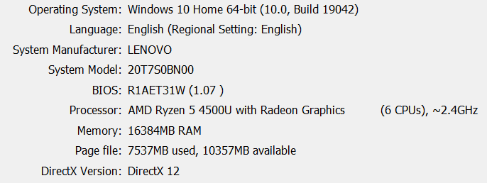

* **Virtual Machine Unbuntu setup**

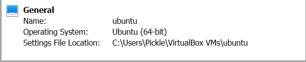

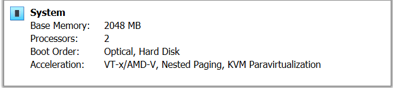

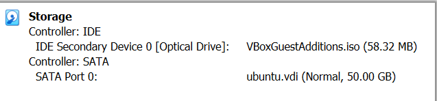

## Software
* Update operating system
 
  

* Download LAMP 

   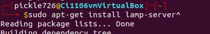

* Download wordpress

  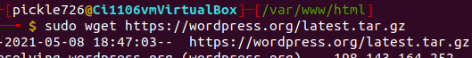

  * unzip file

   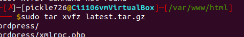
   
     * Change permissionsls
   
   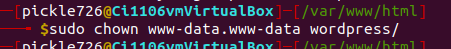

  * Download mysql and create username and password
  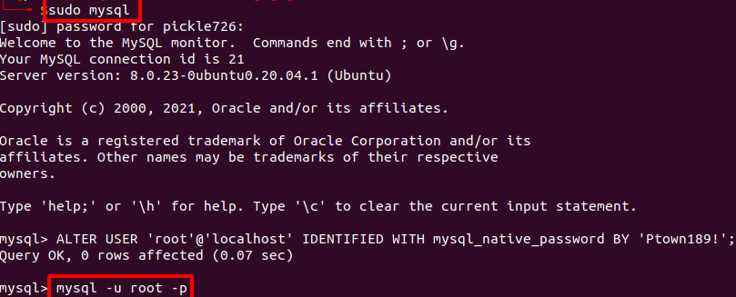 
  
  * create database
  
  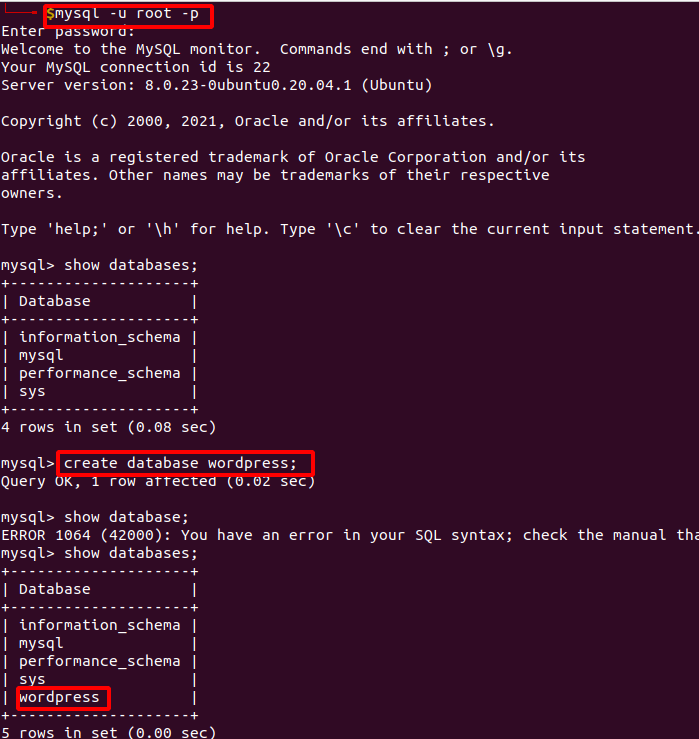
* Connect to server and database then create account

  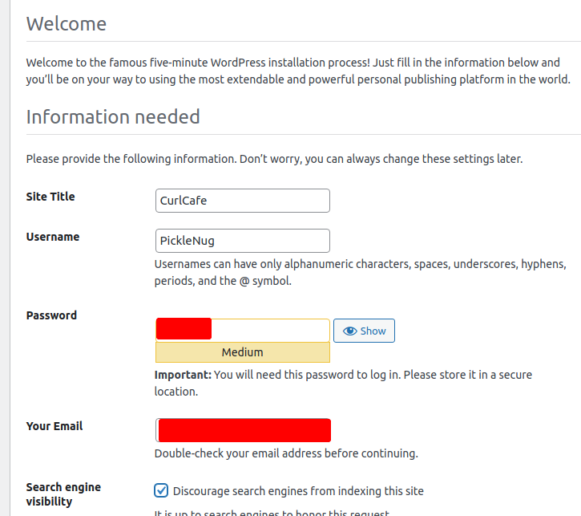
  

## Difficulties
Creating a database for word press was challenging to find the code to access mysql. To overcome this road block I searched the appropriate code to to access mysql. The problem was I did not download is properly so it was not allowing me access to make changes.
## Source
[Ubuntu.Help](https://help.ubuntu.com/community/ApacheMySQLPHP)

[Wordpress](https://wordpress.org/download/)

