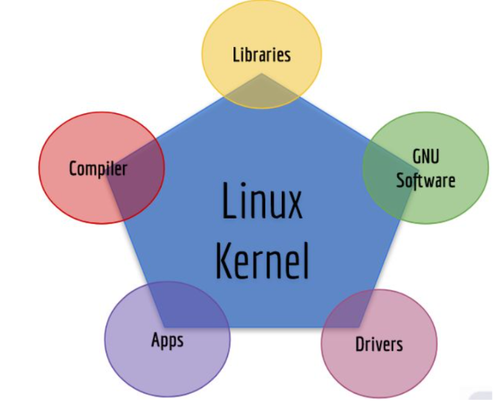
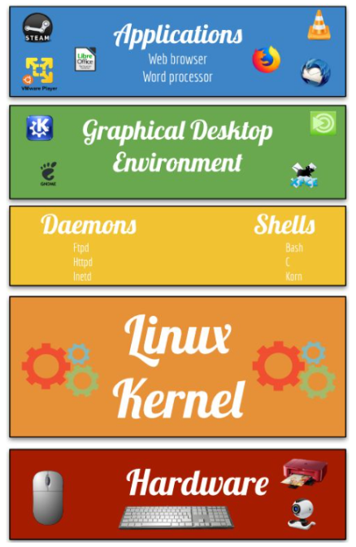
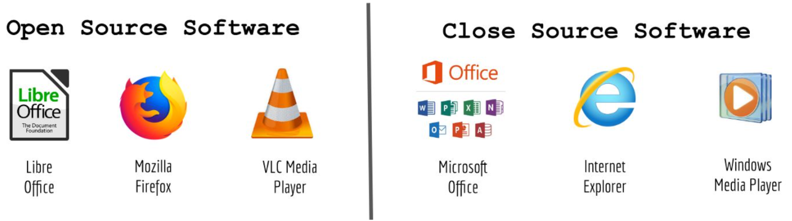
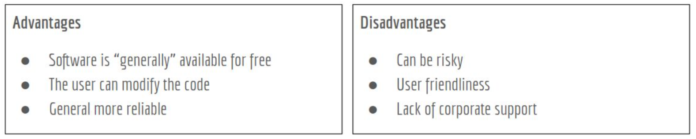
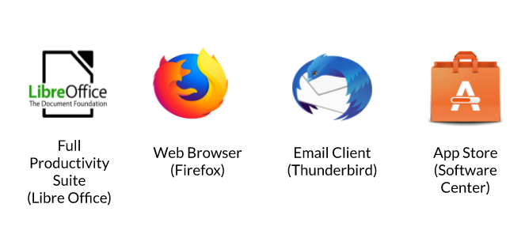

# Notes Lecture 1 what is Linux
### Why do you need to learn linux?
* Linux runs in a lot of devices. Example: Laptops, desktops, servers, smartphones, IoT, ect
* Linux powers the cloud
* Linux is used by a lot of companies even Microsoft
  ### What is Linux?
  * Linux is a kernel. A kernel is the core of any operating system
  * An operating system that uses the linux kernel is called a linux distribution. Example: Ubuntu and Android.
  * Linux is a multitasking, multi-user, and multipurpose OS.
  * Linux is a modular operating system.
   ### Linux books I can use:
   * Linux Administation A Beginners's Guide 8th editioin by Wale Soyinka
   * CompTia Linux + study Guide by Christine Bresnahan
   * The Linux Command Line By William Shotts
 * ### Linux distributions
  
  * There are a Large number of Linux Distributions.
  * There are two main Linux Distributions:
    * Debian
    * Redhat
  * There are also other independent distributions:
    * Slackware
    * Arch
    * Gentoo
  ### Linux Architecture
  
  * Linux is modular which means that the users can remove and add/remove what ever they need or don't need.
    * **Kernel** = the core of the system. Manages the hardware.
    * **Daemons** = background programs that run independent of the user.
    * **Shells** = the interface that accepts user input and translates it so that the kernel can use it.
    * **Graphical Desktop Enviornment** = a collection of software that makes the graphical interface.
  * In linux everything is a file.
    * Device files
    * Dsirectory files
    * Binary files
    * Regular files
  ### Software licensing agreement
  * A license agreement outline the rights a user has to a given software
  * Types of licensing agreements:
 
  Opens source | Closed source | free software 
---------------|---------------|--------------
Software can be distributed for free or a fee. **The source code must be distributed with the software.**| Software can be distributed for free or a fee. **The end user has limited access to the software and the source code is not available.** | Software can be distributed for free or a fee. The user has total control of the software and the source code. The software must comply with the 4 freedoms

#### the 4 freedoms
* Freedom 0: the user can run the program as you wish, for any purpose .
* Freedom 1: the user can study how the program works, and change it
* Freedom 2: the user can redistribute copies
* Freedom 3: the user can distribute copies of your modified versions.
  **Learn more:** [gnu](https://www.gnu.org/philosophy/free-sw.en.html)
  
  **Advantages/Disadvantages of Open Source software**
  
  ### What is Ubuntu?
* linux Distributer available free of charge.
* Shipped in Stable and regular release cycles
  * **Regular or non-LTS:** shipped every six months and supported for 9 months.
   * **LTS (long-term support)** Shipped every two even years and is supported for 5 years.
  * Suitable for both desktop and server use.
  **included in thousands of pieces of software such as:**

  

  ### What is Debian?
* A all volunteer organization dedicated to developing free software and promoting the ideals of the free software community.
* Began in 1993. Ian Murdock gathered a group of developers to create a coherent linux distribution.
* Known as the grandfather of all linux distribution along with Slackware and open source.
* Ubuntu is the user friendly versin of Debian.
### What is GNU/Linux
* Linux is modelled on the Unix operating system.
* Linux what a multitasking , multi-user system
* No one owns linux. Most of development is done by volunteers.
* Linux operating system is a really combination the Linux Kernel and the GNU Tools developed by the free software foundation.

  
  
  