# Lab 4 Part 1
## Question 1 : Create files and Directories

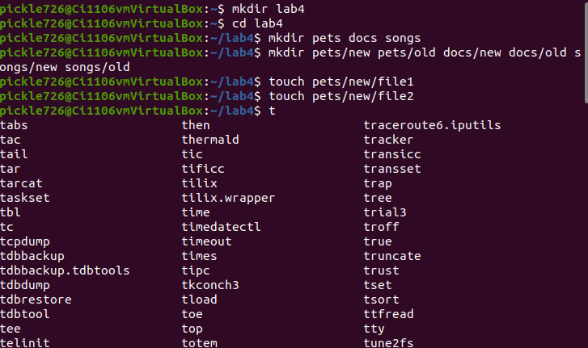
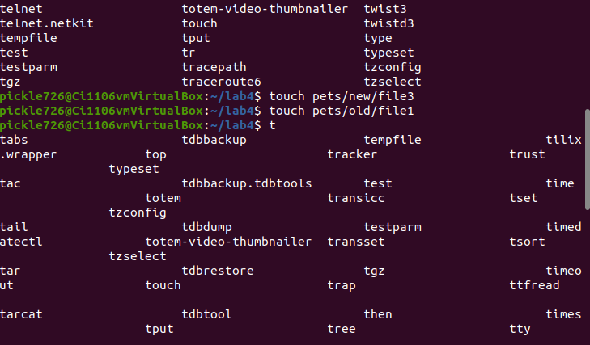

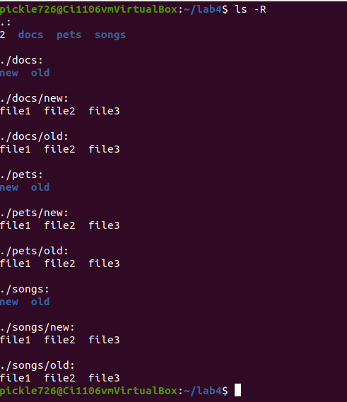
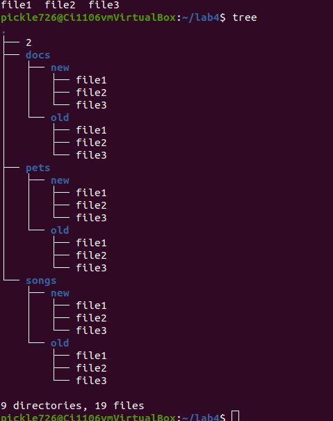

## Question 2 : Removing Files and directories

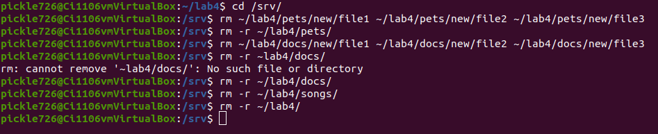

## Question 3 : Moving Files and Directories

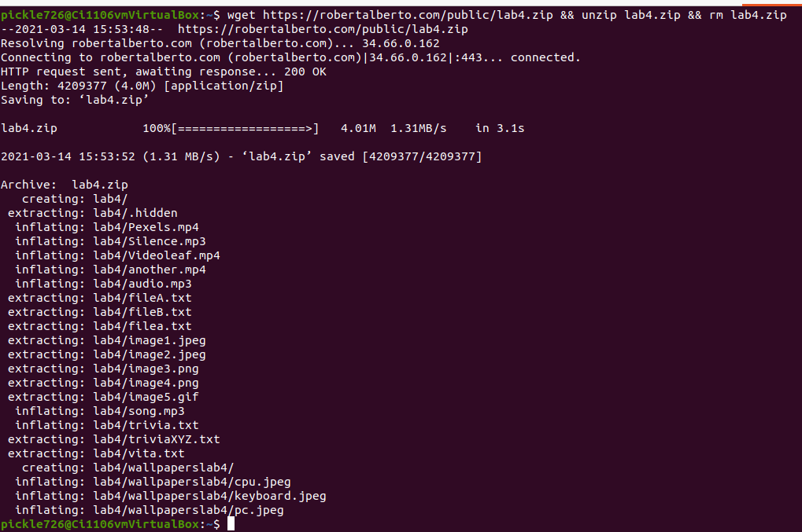
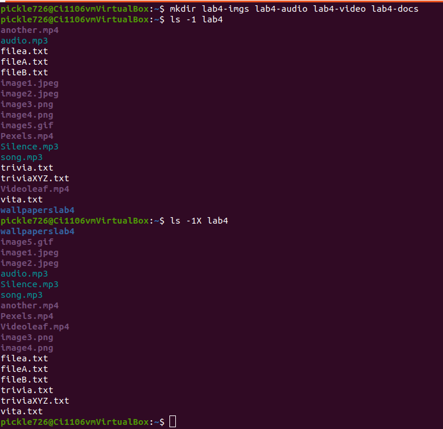

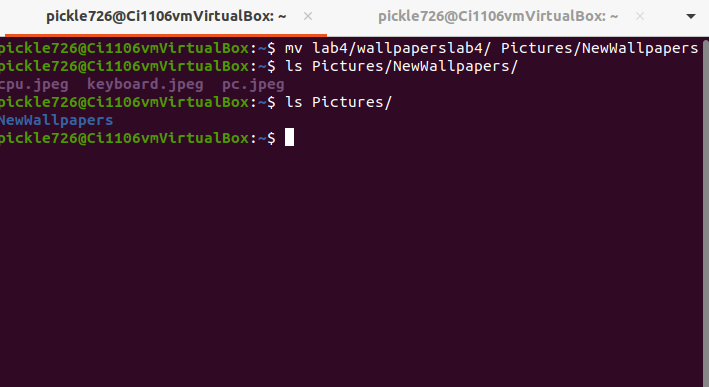

## Question 4 : Copying Files and Directories 

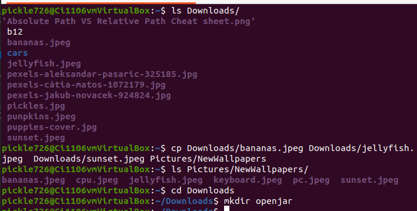
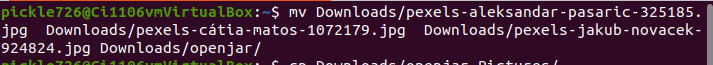
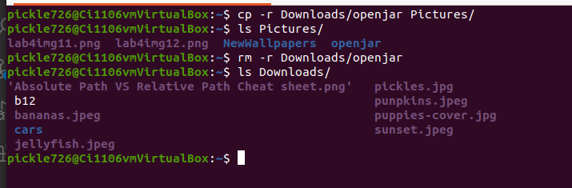
