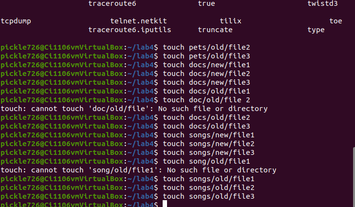
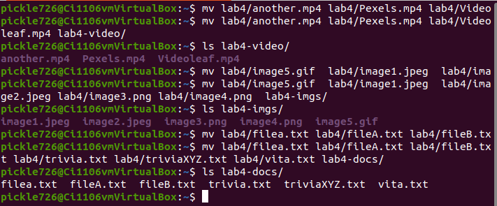

# Lab 4 Part 1
## Question 1 : Create files and Directories

## Question 2 : Removing Files and directories

## Question 3 : Moving Files and Directories

## Question 4 : Copying Files and Directories 

