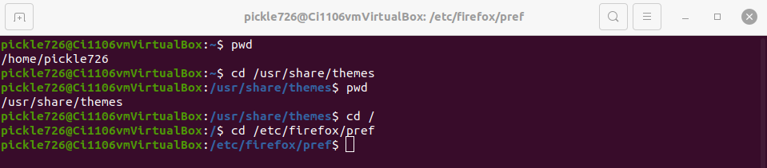
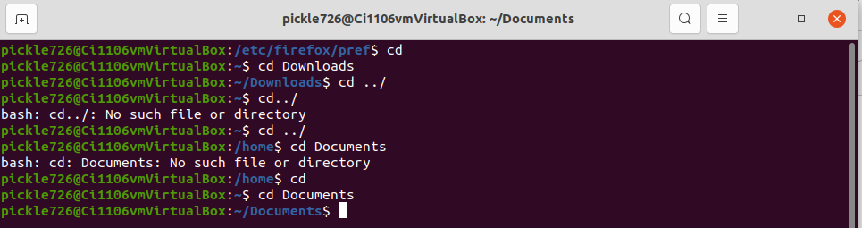
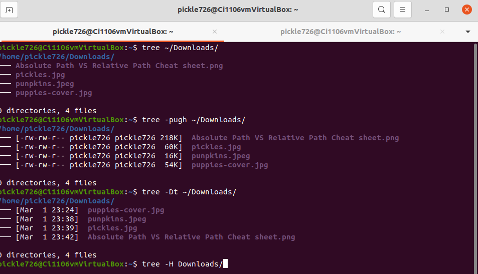
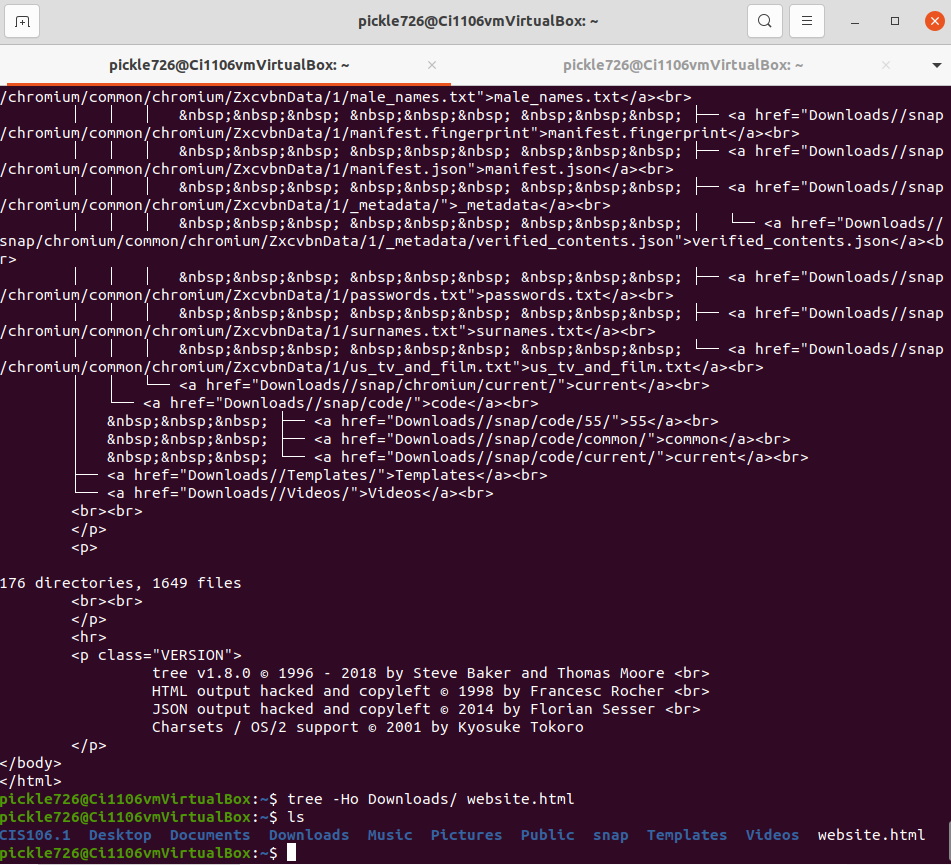
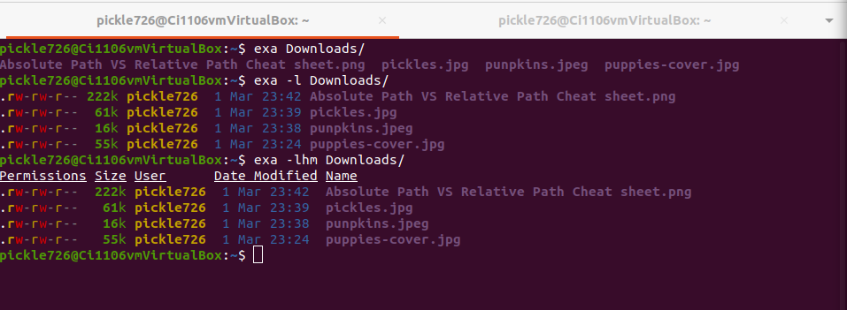
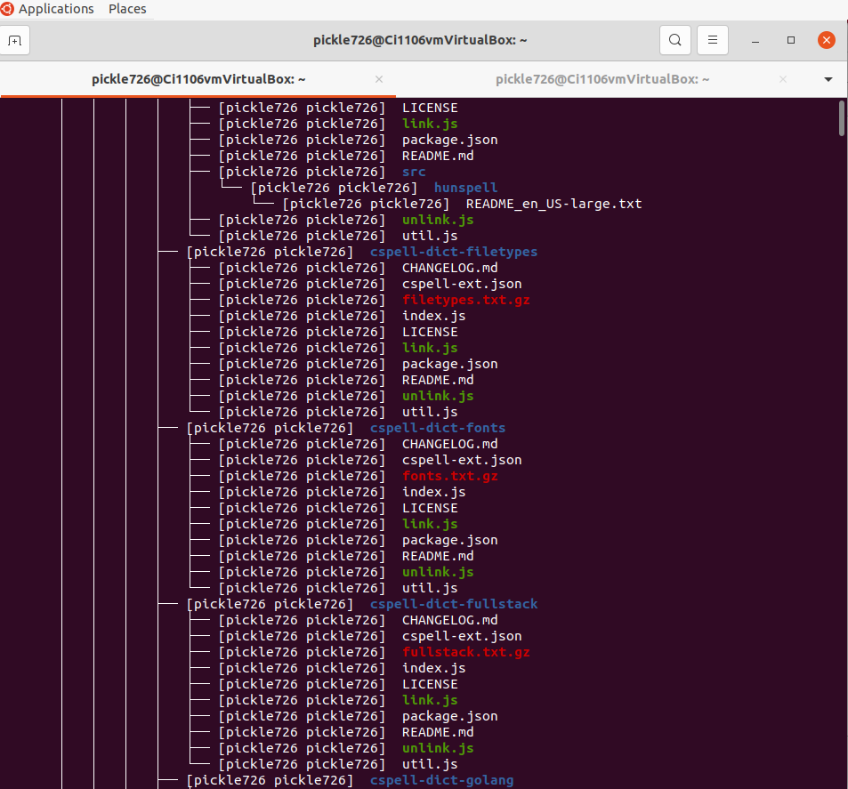
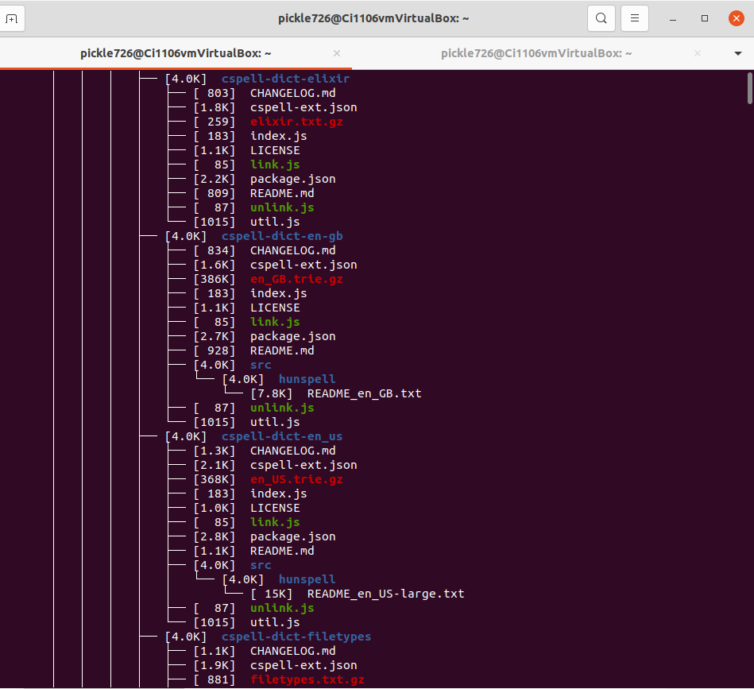

# Lab 3 | Installing software and navigating the file system | Answers
Assignment description [here](https://raw.githubusercontent.com/ra559/cis106/main/labs/lab3.md)

## Question 1
1. Which command did you use to search for the themes and to install them? 
 * search: apt search theme , instal: sudo apt install yuyo-gtk-theme
2. Which commands did you use to find and install the web browser?
 * apt search web browser 
  
3.1 What is the name of the package?
 * xubuntu-docs 
  
3.2 What dependencies are needed in order to install the package? (you can either take a screenshot of the terminal or copy and paste from the terminal)
none
3.3 How much disk space will the package utilize after installation? 
12.1 MB
 
## Question 2

## Question 3
1[img4](../img/lab3img4.png)
## Question 4

## Question 5

