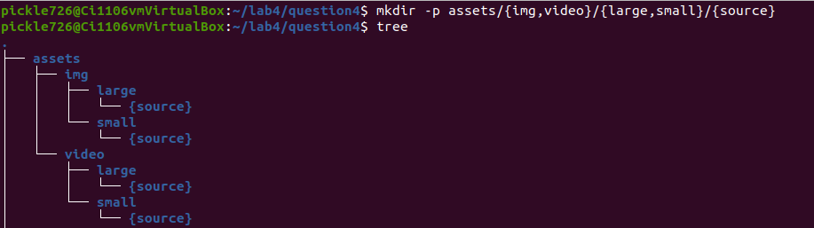
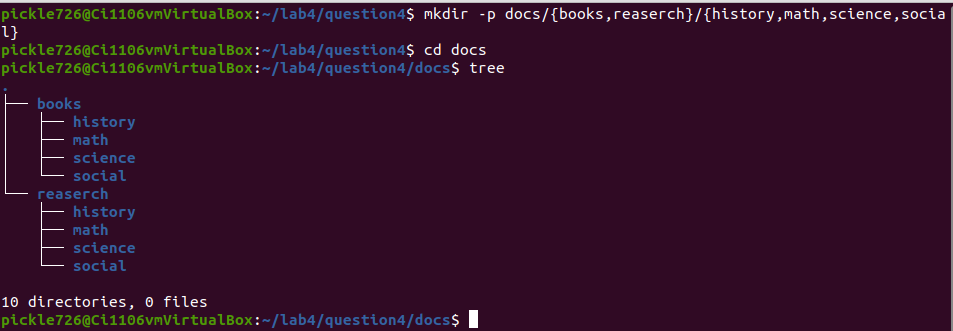

# Lab 4.2 file Globing/wildcards

## Question 1 Using * Wildcard

### Problem 1

### Problem 2

### Problem 3

### Problem 4

### Problem 5

## Question 2 Using ? Wildcard

### Problem 1

### Problem 2

### Problem 3

### Problem 4

## Question 3 Using [] Wildcard

### Problem 1

### Problem 2

### Problem 3

### Problem 4

## Question 4 Using Brace expansion

### Problem 1

### Problem 2

### Problem 3

### Problem 4

### Problem 5

