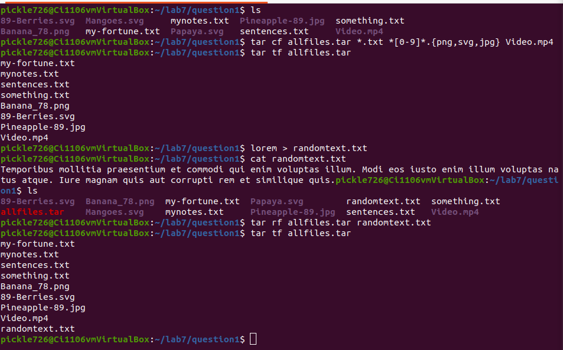
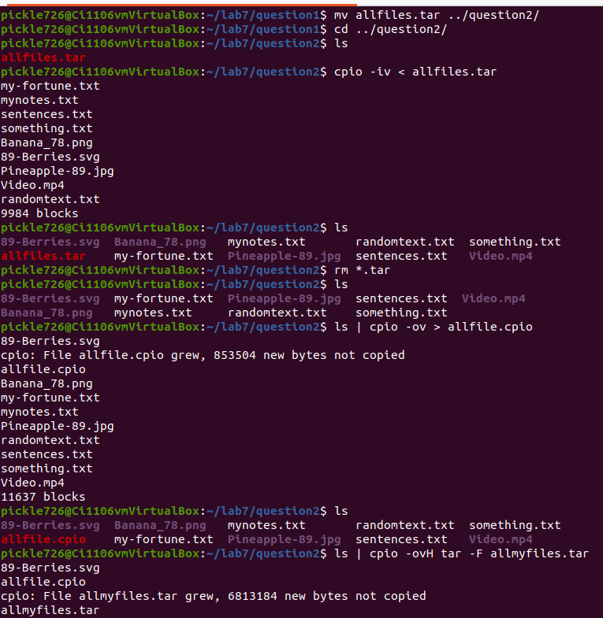
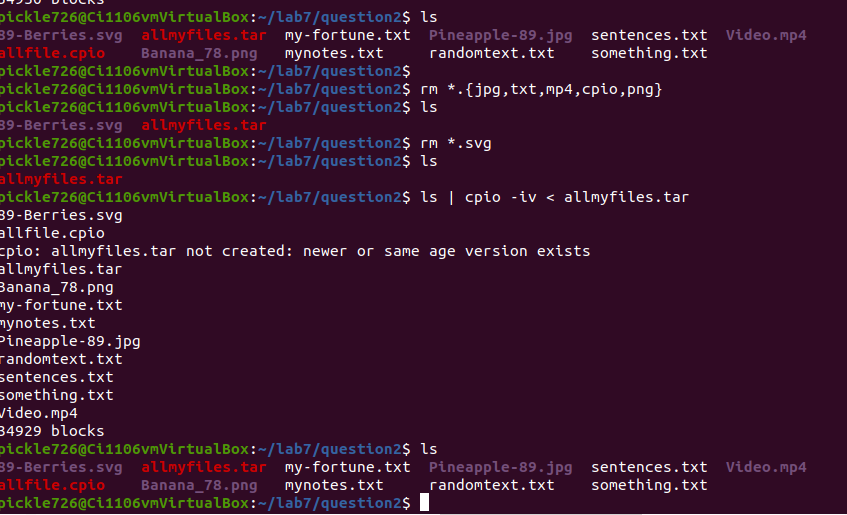
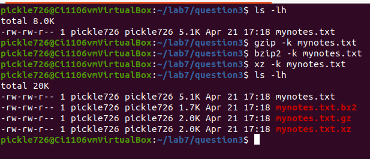
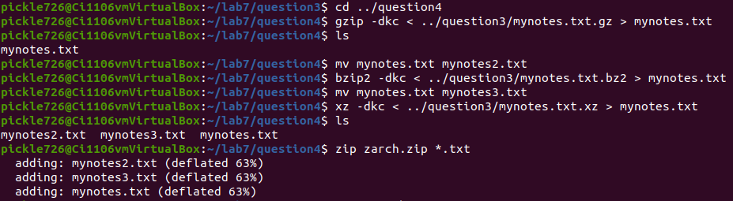
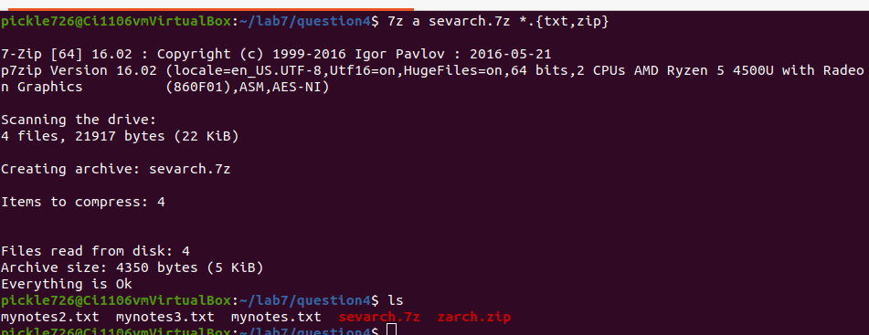
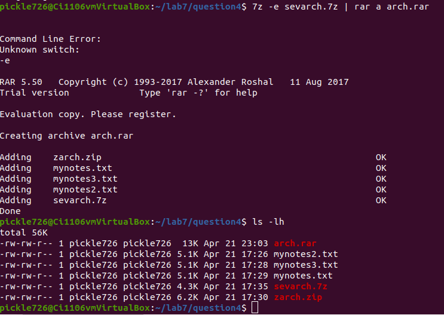

#Lab 7 | Managing Data

## Question 1 | Tar Utility

## Question 2 | Cpio Utility

## Question 3 | Gzip, bzip2, xz
1. In the question3 directory you will find 1 file called mynotes.txt. What is the size of this file? **5.1k bytes**.
   
2. Long list all the files. Which tool gave you the best compression? **gzip**.
   

## Question 4 | Zip, 7zip and Rar

