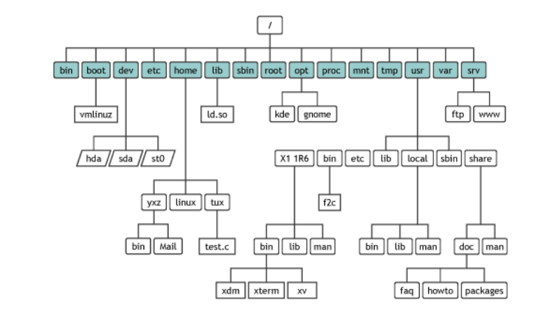

# Notes 3
### Exploring Desktop Environments
  * Before DE there was the CLI
  * There are multiple graphical desktops options 
    * EX) 
  * GuI: Graphical user interface that allows user to use apps and windows
  * DE:Desktop environment made of a bundle of programs running on opp systems. similar to GUI . somtimes describe as graphical shell.
  * Different distributions ship with different desktop environments.
    * most common GNOME and KDE
  * Linux is not limited like Window and MacOS
  * DE provides a predetemined look and feel to the GUI. its typically broken into the following graphical sections and functions
    * Desktop settings
    * Display Manager
    * File manager
    * Icons
    * Favorites bar
    * Launcher
    * Menus
    * Panels 
    * System Tray
    * Widgets
    * Window Manager

### What is a Shell?
Shells make Large Scale IT Possible. They're a necessary component to modern computing.
**The Linux terminal** 
* **CLI** A command line interface is a means of interacting with a computer program where the user issues commands to the program in the form of succesive lines off text.
* The two ways to access the CLI:
  * Terminal Emulator
  * Linux Console
  **Console Terminals**
  * one way to get to a CLI is to take thr linux system out of graphical desktop mode and place in text mode
    * it emulates the old days of hard-wired console terminal and is a direct interface to linux system.
  * When Linux system starts it automatically creates severak virtual consoles.
    * a virtual console is a terminal session that runs in linux system memory.
  * Most linux distributions start five or six terminals.
  **Terminal Emulator**
  A terminal emulator is aprogram that allows you to access the Linux CLI. Most the time you will be using a terminal emulator if you have GUI installed.

  Some Terminal emulators are:
  * GNOME Terminal
  * Konsole
  * Terminology
  * RXVT-Unicode
  * TILIX
  **The Bash Shell**
  * A program that provides interactive access to the Linux system
  * Runs on regular programs and starts when user logs into a terminal
  * Most Linux distributions ise bash shell as default shell.
  * Other shells
    * Tcsh Shell
    * Csh Shell
    * Ksh Shell

### Managing Software
**Basic Terminology**
* Package: archives that contain binaries of software, configuration files and information about dependencies.
* Library reusable code that can be used by more than one function or program.
* Dependency: software needed as a foundation for other software
* Repository: a large collection of software available for download.

### The Linux File system
* file system: the way files are stored and orginized to simplify access to data.
* Linux organizes its files in what is called a hierachical directory structure (tree- like pattern of folders)
* Directory and folder mean the same thing
* the first directory in the file system in called **root** directory. the root contains files and subdirectories.
* **Filesystem hierarchy standard** (FHS): specifies requirements and guidelines for file and directory placement in UNIX-like operating systems
**Linux Directory structure**
* think of the file system as a tree where every branch represents a directory (folder)
* you always work inside a particular directory and you can move forward to subdirectory or backwards to a parent directory
* the directory where you are currently is called the current working directory or present working directory.
* in a file system every file has a pathname which indicates the location of the filesystem (like an address)

** Commands to move around the filesystem**
* **pwd** - displays current directory
* **cd** - used to change directory
* **ls** - used to display all the files inside a given directory. when no specific directory displays the files in the current working directory
  **Types of Pathnames**
  * absolute path - states the full pathname starting from root (/).Always starts from the root
    * EX) /home/john/downloads/song.mp3
  * Relative path - specifies the pathname starting from the current directory. always starts with a subdirectory.
    * EX) downloads/song.mp3