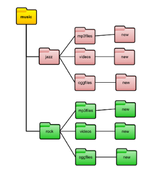
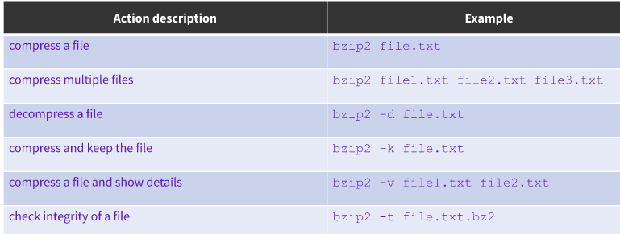
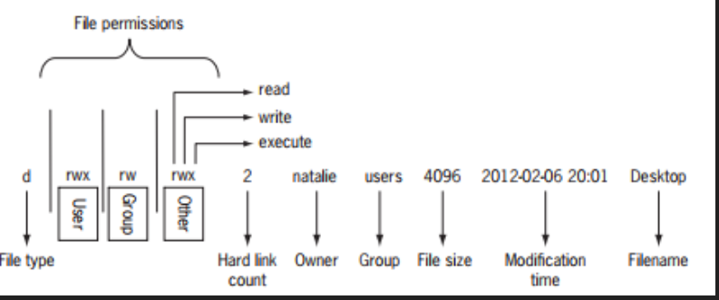

# Final Notes
 ## Table OF Content

- [Final Notes](#final-notes)
  - [Table OF Content](#table-of-content)
- [Notes Lecture 1 what is Linux](#notes-lecture-1-what-is-linux)
    - [Why do you need to learn linux?](#why-do-you-need-to-learn-linux)
    - [What is Linux?](#what-is-linux)
    - [Linux books I can use:](#linux-books-i-can-use)
    - [Linux Architecture](#linux-architecture)
    - [Software licensing agreement](#software-licensing-agreement)
      - [the 4 freedoms](#the-4-freedoms)
    - [What is Ubuntu?](#what-is-ubuntu)
    - [What is Debian?](#what-is-debian)
    - [What is GNU/Linux](#what-is-gnulinux)
- [Notes Lecture 02](#notes-lecture-02)
    - [What is Virtualization?](#what-is-virtualization)
    - [Server-Side Virtualization.](#server-side-virtualization)
    - [Client-side virualization.](#client-side-virualization)
    - [Type 1 VS Type 2 Hypervisor](#type-1-vs-type-2-hypervisor)
    - [VirtualBox](#virtualbox)
    - [Installing Ubuntu 20.04](#installing-ubuntu-2004)
    - [What is a Raspberry Pi](#what-is-a-raspberry-pi)
- [Notes 3](#notes-3)
    - [Exploring Desktop Environments](#exploring-desktop-environments)
    - [What is a Shell?](#what-is-a-shell)
    - [Managing Software](#managing-software)
    - [The Linux File system](#the-linux-file-system)
- [Manipulating files and directories](#manipulating-files-and-directories)
    - [Managing files and directories](#managing-files-and-directories)
    - [Moving and copying files](#moving-and-copying-files)
  - [getting help](#getting-help)
  - [Working with wildcards](#working-with-wildcards)
    - [Quick Reference](#quick-reference)
  - [Shell Expansion](#shell-expansion)
- [Command Line text editors](#command-line-text-editors)
  - [Basics of Nano](#basics-of-nano)
  - [Basics of VIM](#basics-of-vim)
    - [Moving around words in a file](#moving-around-words-in-a-file)
    - [Searching words in vim](#searching-words-in-vim)
    - [Screen Movement](#screen-movement)
    - [Moving lines](#moving-lines)
    - [Delete text and copy and paste](#delete-text-and-copy-and-paste)
    - [Change text](#change-text)
- [Handling text files](#handling-text-files)
  - [Cat](#cat)
  - [Tac](#tac)
  - [More](#more)
  - [Less](#less)
  - [Head](#head)
  - [Tail](#tail)
  - [Cut](#cut)
  - [Paste](#paste)
  - [Sort](#sort)
  - [Wc](#wc)
  - [Tr](#tr)
  - [Diff](#diff)
  - [Grep](#grep)
  - [Rev](#rev)
- [Notes 6](#notes-6)
- [Text Editor](#text-editor)
  - [Basics of Nano](#basics-of-nano-1)
  - [Basics of VIM](#basics-of-vim-1)
    - [Moving around words in a file](#moving-around-words-in-a-file-1)
    - [Searching words in vim](#searching-words-in-vim-1)
    - [Screen Movement](#screen-movement-1)
    - [Moving lines](#moving-lines-1)
    - [Delete text and copy and paste](#delete-text-and-copy-and-paste-1)
    - [Change text](#change-text-1)
  - [Managing Data](#managing-data)
  - [Archiving utilities](#archiving-utilities)
    - [The tar program](#the-tar-program)
    - [The CPIO program](#the-cpio-program)
    - [The ar utility](#the-ar-utility)
  - [File Compression](#file-compression)
  - [File compression | GZIP, BZIP2,XY](#file-compression--gzip-bzip2xy)
      - [gzip](#gzip)
      - [bzip2](#bzip2)
      - [xz](#xz)
  - [File compression | zip,7zip, and rar](#file-compression--zip7zip-and-rar)
  - [File Permissions | file ownership](#file-permissions--file-ownership)
      - [Ls -l output review](#ls--l-output-review)
      - [File Permission](#file-permission)
      - [Files vs Directories](#files-vs-directories)
    - [The chmod command](#the-chmod-command)
      - [Symbolic Notation](#symbolic-notation)
      - [Numeric Notation](#numeric-notation)

# Notes Lecture 1 what is Linux
### Why do you need to learn linux?
* Linux runs in a lot of devices. Example: Laptops, desktops, servers, smartphones, IoT, ect
* Linux powers the cloud
* Linux is used by a lot of companies even Microsoft
  ### What is Linux?
  * Linux is a kernel. A kernel is the core of any operating system
  * An operating system that uses the linux kernel is called a linux distribution. Example: Ubuntu and Android.
  * Linux is a multitasking, multi-user, and multipurpose OS.
  * Linux is a modular operating system.
   ### Linux books I can use:
   * Linux Administation A Beginners's Guide 8th editioin by Wale Soyinka
   * CompTia Linux + study Guide by Christine Bresnahan
   * The Linux Command Line By William Shotts
 * ### Linux distributions
  
  * There are a Large number of Linux Distributions.
  * There are two main Linux Distributions:
    * Debian
    * Redhat
  * There are also other independent distributions:
    * Slackware
    * Arch
    * Gentoo
  ### Linux Architecture
  
  * Linux is modular which means that the users can remove and add/remove what ever they need or don't need.
    * **Kernel** = the core of the system. Manages the hardware.
    * **Daemons** = background programs that run independent of the user.
    * **Shells** = the interface that accepts user input and translates it so that the kernel can use it.
    * **Graphical Desktop Enviornment** = a collection of software that makes the graphical interface.
  * In linux everything is a file.
    * Device files
    * Dsirectory files
    * Binary files
    * Regular files
  ### Software licensing agreement
  * A license agreement outline the rights a user has to a given software
  * Types of licensing agreements:
 
  Opens source | Closed source | free software 
---------------|---------------|--------------
Software can be distributed for free or a fee. **The source code must be distributed with the software.**| Software can be distributed for free or a fee. **The end user has limited access to the software and the source code is not available.** | Software can be distributed for free or a fee. The user has total control of the software and the source code. The software must comply with the 4 freedoms

#### the 4 freedoms
* Freedom 0: the user can run the program as you wish, for any purpose .
* Freedom 1: the user can study how the program works, and change it
* Freedom 2: the user can redistribute copies
* Freedom 3: the user can distribute copies of your modified versions.
  **Learn more:** [gnu](https://www.gnu.org/philosophy/free-sw.en.html)
  
  **Advantages/Disadvantages of Open Source software**
  
  ### What is Ubuntu?
* linux Distributer available free of charge.
* Shipped in Stable and regular release cycles
  * **Regular or non-LTS:** shipped every six months and supported for 9 months.
   * **LTS (long-term support)** Shipped every two even years and is supported for 5 years.
  * Suitable for both desktop and server use.
  **included in thousands of pieces of software such as:**

  

  ### What is Debian?
* A all volunteer organization dedicated to developing free software and promoting the ideals of the free software community.
* Began in 1993. Ian Murdock gathered a group of developers to create a coherent linux distribution.
* Known as the grandfather of all linux distribution along with Slackware and open source.
* Ubuntu is the user friendly versin of Debian.
### What is GNU/Linux
* Linux is modelled on the Unix operating system.
* Linux what a multitasking , multi-user system
* No one owns linux. Most of development is done by volunteers.
* Linux operating system is a really combination the Linux Kernel and the GNU Tools developed by the free software foundation.

# Notes Lecture 02
### What is Virtualization?
* Creating a "fake" computer inside of your pc.
* Two general types of virtualization.
  * Server-side virtualization.
  * Client-side virtualization. 
      * Difference is where the virtualization takes place.
  ### Server-Side Virtualization.
**Virtual Desktop Infrastructure (VDI)**
* Thin Client or Fat client
* Thin client
* Zero client
  ### Client-side virualization.
 * Softwar installed to manage Virtual Machine VM.
 * each VM has its own opp system.
 * For client side virtualization, Comp needs:
    * A hypervisor (software that allows management of VM)
    * Hardware support
  * capable CPU
  * Enough RAM
  * Enough storage
  ### Type 1 VS Type 2 Hypervisor
  **Type 1**
  Runs on hardware
    EX) VMware ESX & ESXi
**Type 2**
Runs on Hosting Operating System
    EX) Oracle VirtualBox
  
  ### VirtualBox
  * Powerful type 2 virtualization product for enterprise as well as home use.
  * Open source software under GPL version 2
  * Supports large number of guest operating systems.
  ### Installing Ubuntu 20.04
  * Name virtual machine
    * Name w/ use of VM
  * Select a memory size 
    * Requires at least 2GB of RAM
  * If you wish Create Hard disc
    * allows to create a virtual hard disk w/ any size
  * Choose type of file you would like to use for the new hard dick
    * Virtual disk image format.
  * Choose storage you would like to use.
    * Select Dynamically allocated.
  * Choose file location size
    * Ubuntu takes about 25GB of disc space.
  ### What is a Raspberry Pi
  The raspberry Pi is a low cost, credit-card sized computer that plugs into a computer monitor or tv, and uses a standard keyboard and mouse. It is capable of doing everything you'd expect a desktop computer to do.

# Notes 3
### Exploring Desktop Environments
  * Before DE there was the CLI
  * There are multiple graphical desktops options 
    * EX) 
  * GuI: Graphical user interface that allows user to use apps and windows
  * DE:Desktop environment made of a bundle of programs running on opp systems. similar to GUI . somtimes describe as graphical shell.
  * Different distributions ship with different desktop environments.
    * most common GNOME and KDE
  * Linux is not limited like Window and MacOS
  * DE provides a predetemined look and feel to the GUI. its typically broken into the following graphical sections and functions
    * Desktop settings
    * Display Manager
    * File manager
    * Icons
    * Favorites bar
    * Launcher
    * Menus
    * Panels 
    * System Tray
    * Widgets
    * Window Manager

### What is a Shell?
Shells make Large Scale IT Possible. They're a necessary component to modern computing.
**The Linux terminal** 
* **CLI** A command line interface is a means of interacting with a computer program where the user issues commands to the program in the form of succesive lines off text.
* The two ways to access the CLI:
  * Terminal Emulator
  * Linux Console
  **Console Terminals**
  * one way to get to a CLI is to take thr linux system out of graphical desktop mode and place in text mode
    * it emulates the old days of hard-wired console terminal and is a direct interface to linux system.
  * When Linux system starts it automatically creates severak virtual consoles.
    * a virtual console is a terminal session that runs in linux system memory.
  * Most linux distributions start five or six terminals.
  **Terminal Emulator**
  A terminal emulator is aprogram that allows you to access the Linux CLI. Most the time you will be using a terminal emulator if you have GUI installed.

  Some Terminal emulators are:
  * GNOME Terminal
  * Konsole
  * Terminology
  * RXVT-Unicode
  * TILIX
  **The Bash Shell**
  * A program that provides interactive access to the Linux system
  * Runs on regular programs and starts when user logs into a terminal
  * Most Linux distributions ise bash shell as default shell.
  * Other shells
    * Tcsh Shell
    * Csh Shell
    * Ksh Shell

### Managing Software
**Basic Terminology**
* Package: archives that contain binaries of software, configuration files and information about dependencies.
* Library reusable code that can be used by more than one function or program.
* Dependency: software needed as a foundation for other software
* Repository: a large collection of software available for download.

### The Linux File system
* file system: the way files are stored and orginized to simplify access to data.
* Linux organizes its files in what is called a hierachical directory structure (tree- like pattern of folders)
* Directory and folder mean the same thing
* the first directory in the file system in called **root** directory. the root contains files and subdirectories.
* **Filesystem hierarchy standard** (FHS): specifies requirements and guidelines for file and directory placement in UNIX-like operating systems
**Linux Directory structure**
* think of the file system as a tree where every branch represents a directory (folder)
* you always work inside a particular directory and you can move forward to subdirectory or backwards to a parent directory
* the directory where you are currently is called the current working directory or present working directory.
* in a file system every file has a pathname which indicates the location of the filesystem (like an address)

** Commands to move around the filesystem**
* **pwd** - displays current directory
* **cd** - used to change directory
* **ls** - used to display all the files inside a given directory. when no specific directory displays the files in the current working directory
  **Types of Pathnames**
  * absolute path - states the full pathname starting from root (/).Always starts from the root
    * EX) /home/john/downloads/song.mp3
  * Relative path - specifies the pathname starting from the current directory. always starts with a subdirectory.
    * EX) downloads/song.mp3

# Manipulating files and directories
### Managing files and directories
Options and Arguments:
* Commands are often followed by options that modify their behavior.
* commands are also followed by arguments which are the items open which commans
  * ex) command -option argument ls -l /Downloads
The **mkdir** command
 * Creates 1 or more directories.
 * use by "mkdir + name of direc"
 * Create multiple directories by separate with a space between.
  * if name of direc contains a space write name with (''or"") 
The **touch** command 
  *   Used to create files 
      *   ex) create file names list ( touch list)
  * you can create multiple files at once 
The **rm** command
* Used to remove files 
* rm by default doesn't remove direct. 
  * to remove direct must use rm with -r ex) rm -r
* can not remove non empty directs
* to remove empty directories use (rmdir)
* to remove none empty directs use (rm -r)
### Moving and copying files
The **mv** command 
* used to move and rename directories.
* basic formula of command
  * mv + source + destination
    * mv downloads/homework.pdf documents/
* formula for renaming files/directs
  * mv + file/directory to rename + new name
    * mv homework.docx cis106homework.docx
  The **cp** command 
  * used to copy files/direct from source to destination. 
  * cp command structure
    * cp + file to copy + destination
  * to copy direct must use -r option
    * cp -r + directory tto copy + destination

## getting help
* Man (manual) page are docs files taht describe Linux shell
* man page are not step by step guides, they're a quick reference
  * ex) man ls
* to quit use "q"
other ways of getting help
* most common -h , --h ,or --help
* error message answer question 
* GOOGLE!

## Working with wildcards
* wildcards rep letters and characters used to specify a filename for searches.
* file globbing is the process of pattern matching using wildcards.
* wildcards are officially called metacharacter wildcards.
* For example.
  * use WC to get long list of all files in the current directory starting with "new"
  * manage directories faster
  * move or delete a group of files
  * locate files based on a portion of filename
  * create files and directories quicker
The **(*)**  Wildcard
* matches anything and nothing and matches any number of characters.
* ex) ls *.txt will match all files that end in .txt regardless of filename

The **(?)** Wildcard
* used  to match precisely one character.
* ex ls .a??*
  *  list all hidden files that start with "a'
  
  The **[]** Wildcard
  * used to match a single character in range
  * ex)
    * to match files that have a vowel after f
      * ls f[aeiou]*
    * match files that dont have vowel after f
      * ls f[!aeiou]*
    * match all files that have range of letters after f
      * ls f[a-z]*
    * match files that have one number in name
      * ls * [1-9] *
  

  ### Quick Reference
  

## Shell Expansion
  The **{}** expansion
  * brace expansioin is not a wildcrd but another feature of bash that aallows you to generate arbitrary string to use with command.
  * ex) creat whole direct structure in a single command
    * mkdir -p music/{jazz,rock}/{mp3file,videos,oggfiles}/new{1..3}
  * ex) create a N number of files
    * touch website{1....5}.html
  * ex) remove multiple files
    * rm -r {dir1,dir2,dir3,file.txt,file.py}
  
  

  # Command Line text editors
## Basics of Nano 

* Can be open by typing nano
* to get help CTRL+G to get help
* CTRL+O to save
* to exit CTRL+X
* to open already existing file type "nano (file name)"
* open file with in nano CTRL+R 
* to copy data ALT+A to select data and copy ALT+^
* to paste CTRL+U
* to cut CTRL+K
* To move to top ALT \ 
* move to bottom ALT /
* ALT+G to find specific line number
* CTRL+W to look for string.
* ALT+R to replace word
* CTRL Y for page up CTRL V for page down

## Basics of VIM
Vim is not included in Ubuntu.
* Start by typing Vim 
* to quit hit esc and type :qa
  * : -> prefix for entering command line mode
  * q -> short for quit
  * a -> short for all buffers
  * ! -> force 
  * :qa! -> quit all
  * w -> saves
* set line numbers -> :set number
**Vim Modes:** 
* **Insert mode:** 
* **Normal mode:**used for manipulating text
  * Navigating file
    * H = left
    * J = down
    * k= up
    * l = right
* **Command mode:**used for writing text
*  **Visual mode:** used for navigation and manipulation of text selections
*  **Select mode:** similar to visual mode
*  **Ex-mode:** Similar to command-line mode but optimized for batch processing.
   *  when you start vim you are in normal
   *  press i to go to insert mode
   *  to switch back to normal hit esc or ctr+c
* edit by entering e "fileName"
### Moving around words in a file
* to move between words use w e
  * w -> moves word by word to the beginning of each word
  * e -> moves word by word at the end of each sentence.
    * 10e will move 10 words
  * To move between sentences use ()
    * ( -> previous sentence
    * ) -> next sentence
  * To move between paragraphs use {}
    * { -> previous paragraph
    * } -> next paragraph
### Searching words in vim
* use "/" and word 
  * ex) /Potato 
* N -> repeats search for the next word
* ? - > search backwards
* (*) -> will search for next occurrence of the word under the cursor
* (#) -> searches backwards for previous occurrence of the word under the cursor
  ### Screen Movement
  * G -> moves to end of file
  * gg -> moves ti beginning of file
  * CTRL+f -> moves a page forward at a time
  * CTRL+b -> moves a page back at a time
  * to move forward multiple pages use number "2 CTRL+f
  ### Moving lines 
  * to move to a specific line use : plus line number
    * :8 will move to line 8 
  * $ -> moves to end of line
  * 0 -> will move to beginning of line
### Delete text and copy and paste
* dw = delete current word
* u = undo
* dd = delete line under curser
*  d + /word = delete until word given
*  yw = copy yhe current word
*  p = for paste after curser
*  P = paste before curser
*  yy = copies whole line
*  x = for cut
### Change text
* cw = deletes the word under the curser and enter insert mode
* c /hello = deletes until finds the word hello and enters insert mode
* Visual selection 
  * SHIFT + V  select line
  * CTRL + V selectd block
* Replace text
  * : s/oldW/newW = replace old word ofr new
  * : s/old/new = replaces the first occurrence of the word old
  * %s/old/new/g = replaces all occurrences of the word old
  * %s/old/new/g/y = will ask to replace word

# Handling text files 
* linux offers a lot of command line toools for handling text.
* some are
  * Cat Tac More Les Head Diff Tail Cut Paste Sort Wc Tr Grep
 ## Cat
* used for displaying the content of a file
* short for concatenate which means joining two strings together.
* Usage) 
  * cat + file to display
  * cat + file1 + file2
![img2]

 ## Tac
* used to display content of file in reversed order in a line by line basis
* The Tac command also concatenate files in revere order
* Usage)
  * tac + file to display
  * tac + file1 + file2
![img3]
 ## More
* used to display the content of a text file one page at a time
* usage) 
  * more + file to view
* for getting help nav the menu press h
* ex) open a file 10 lines at a time
  * more -10 /var/log/syslog
## Less
* used to display less content at a time
* faster than more when dealing with large file
* ex) open file with line number
  * less -N /var/log/syslog
* ex) open file at the beginning of the first occurance of string
  * less -p "nobody" /ect/passwd
 ## Head
* displays the top N numbers of lines of file. default prints first 10 lines. 
* ex) display first 10 lines of a file
  * head /ect/passwd
* ex) display the first 5 lines of file
  * head -5 /etc/passwd
## Tail
* displays last N number of lines in file. default last 10 lines.
* ex) display last 10 lines 
  * tail /ect/passwd
* ex) display last 5 lines
  * tail -5 /ect/passwd.
## Cut
* used to extract a specific section of each line of file and display it on the screen.
## Paste
* used to join files horizontally in columns.
## Sort
* used for sorting files
* sorts content of text files in particular order.
* supported sorting:
  * Alphabetically 
  * In reverse order
  * by number
  * by month
* ex) sort file in reverse order
  * sort -r users.txt
## Wc 
* used for printing the number of lines, characters, and bytes ina file
## Tr
* used for  translating or deleting characters from standard output.
## Diff
* compares files and displays the difference between them.
## Grep
* used to match string patterns from file or standard output when using the pipe
## Rev
* used for reversing the characters position in a given text.

# Notes 6 
# Text Editor
## Basics of Nano 

* Can be open by typing nano
* to get help CTRL+G to get help
* CTRL+O to save
* to exit CTRL+X
* to open already existing file type "nano (file name)"
* open file with in nano CTRL+R 
* to copy data ALT+A to select data and copy ALT+^
* to paste CTRL+U
* to cut CTRL+K
* To move to top ALT \ 
* move to bottom ALT /
* ALT+G to find specific line number
* CTRL+W to look for string.
* ALT+R to replace word
* CTRL Y for page up CTRL V for page down

## Basics of VIM
Vim is not included in Ubuntu.
* Start by typing Vim 
* to quit hit esc and type :qa
  * : -> prefix for entering command line mode
  * q -> short for quit
  * a -> short for all buffers
  * ! -> force 
  * :qa! -> quit all
  * w -> saves
* set line numbers -> :set number
**Vim Modes:** 
* **Insert mode:** 
* **Normal mode:**used for manipulating text
  * Navigating file
    * H = left
    * J = down
    * k= up
    * l = right
* **Command mode:**used for writing text
*  **Visual mode:** used for navigation and manipulation of text selections
*  **Select mode:** similar to visual mode
*  **Ex-mode:** Similar to command-line mode but optimized for batch processing.
   *  when you start vim you are in normal
   *  press i to go to insert mode
   *  to switch back to normal hit esc or ctr+c
* edit by entering e "fileName"
### Moving around words in a file
* to move between words use w e
  * w -> moves word by word to the beginning of each word
  * e -> moves word by word at the end of each sentence.
    * 10e will move 10 words
  * To move between sentences use ()
    * ( -> previous sentence
    * ) -> next sentence
  * To move between paragraphs use {}
    * { -> previous paragraph
    * } -> next paragraph
### Searching words in vim
* use "/" and word 
  * ex) /Potato 
* N -> repeats search for the next word
* ? - > search backwards
* (*) -> will search for next occurrence of the word under the cursor
* (#) -> searches backwards for previous occurrence of the word under the cursor
  ### Screen Movement
  * G -> moves to end of file
  * gg -> moves ti beginning of file
  * CTRL+f -> moves a page forward at a time
  * CTRL+b -> moves a page back at a time
  * to move forward multiple pages use number "2 CTRL+f
  ### Moving lines 
  * to move to a specific line use : plus line number
    * :8 will move to line 8 
  * $ -> moves to end of line
  * 0 -> will move to beginning of line
### Delete text and copy and paste
* dw = delete current word
* u = undo
* dd = delete line under curser
*  d + /word = delete until word given
*  yw = copy yhe current word
*  p = for paste after curser
*  P = paste before curser
*  yy = copies whole line
*  x = for cut
### Change text
* cw = deletes the word under the curser and enter insert mode
* c /hello = deletes until finds the word hello and enters insert mode
* Visual selection 
  * SHIFT + V  select line
  * CTRL + V selectd block
* Replace text
  * : s/oldW/newW = replace old word ofr new
  * : s/old/new = replaces the first occurrence of the word old
  * %s/old/new/g = replaces all occurrences of the word old
  * %s/old/new/g/y = will ask to replace word
  
## Managing Data
**Basic Terminology**
* backup - copies of files and directories to an archive
* system backup used to restore data in a case of a system failure or data loss and corruption
* Archive file containing many other files, each of which is still identified by its file name owner, permissions, and timestamp
* list of important directories to include in system backups:
  * | /etc | /home | /opt | /root | /var |
  ## Archiving utilities 
  * **Tar (tape archive):** creates archive by combining files and directories into a single file/
  * **CPIO:** creates an archive, restores files from an archive, or copies a directpry hierarchy. the cpio utility has 3 modes od operation
    * create (copy-out)  mode places multiple files into a single archive file
    * extract (copy-in) mode restores file from archive
    * pass-through (copy-pass) mode copies a directory hierarchy.
  * **AR:** creates,modifies, and extracts from archives.
### The tar program
* to create archive :
  * tar + options + archive name + files to add to archive
* To extract an archive:
  * tar + options + file to extract
  
  **Tar command example explained**
  
 
  **option -f always required.**
  * the -v option displays details of the operation. 
  * files inside archives are called members.
  
  ### The CPIO program 
  Cpio requires a list of files to archive. the option to create an archive is -o
  * ls | cpio -ov > archive.cpio
  To extract archive to cpio use the -i option with <
  * cpio -iv < archive.cpio 
  Archive specific files
  * find . -iname *.sh | cpio -ov > scriptsArchive.cpio
  Create a tar archive with cpio 
  * ls | cpio -ov -H tar -F sample.tar
  Extract *.tar Archive File using cpio
  * cpio -idv -F sample.tar
  View the content of *.tar Archive file
  * cpio -it -F sample tar
### The ar utility
Creates, modifies and extracts from archives
Archive files with ar
* ar r test.a *.txt
List contents of an archive
* ar t test.a
  Add a new member to an archive
  * ar r test.a test3.txt
  Delete a member from archive
  * ar d test.a test3.txt
  
  ## File Compression
  * The **gxip, bzip2** , and **xz** commands are used for compression.
  * when you compress a file with any of these tools the result is a file with similar name but with the correspondent file extension
  * **Example**
    * file.txt ---> file.txt.gz
    * file.txt ---> file.txt.bz2
    * file.txt ---> file.txt.xz
  ## File compression | GZIP, BZIP2,XY
  * Gzip, bzip2, and xz compares files in place meaning the original file is deleted after compression.
  * **bzip2** offers better compression ratio then gzip
  * **xz** produces better compression ratios than gzip and bzip2.
  #### gzip
  
  #### bzip2
  
  #### xz
  

  ## File compression | zip,7zip, and rar
  * zip is an archiving and compression utility
  * to use : zip + archiveName.zip + files to include in archive
  * to unarchive use : unzip archive.zip
* 7zip 
  * to use : 7z + option + fileName.7z + files to archive
* Rar is a pproprietart archive file format. allows linux users to extract rar archives
  * to use : unrar + option + filename.rar
  
  ## File Permissions | file ownership
  * a file can be owned only by one user and one group
  * **ls -l** shows u=you the file user owner and group owner
  * the **/etc/passwd** file contains a list of all the users in linux
  * the **/etc/group** file contains a list of all the group in linux
  * the **chown** command is used for changing group owner.
    * *syntax* : chown user: group file
    * EX0
      * chown john file.txt
      * chown :marketinGroup file.tex
      * chown john:marketinGroup file.txt
  #### Ls -l output review
  
  #### File Permission
  
  #### Files vs Directories
  

  * the hyphen (-) represents a permission that hasn't been granted.
  ### The chmod command
  * is used to change permission on files and directories
  * the permission argument is the info used to change permission
  * the file/direc argument specifies the file or direc tou want to change
  * you can use chmod in two ways to change permission
    * Symbolic notation
    * Numeric notation
  
  #### Symbolic Notation
  
  
  #### Numeric Notation 
  

  

  