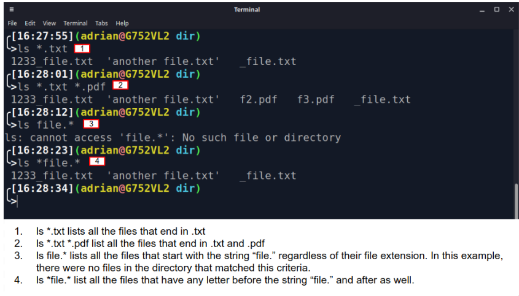
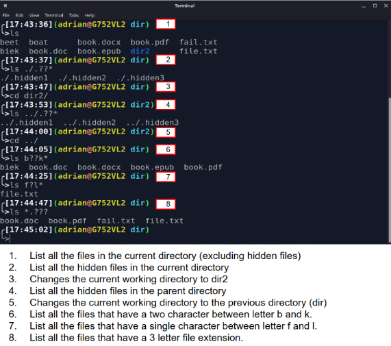
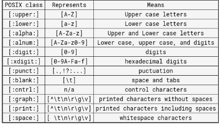
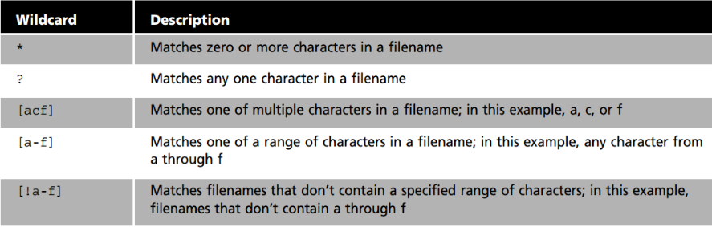
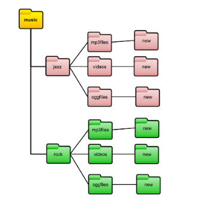

# Manipulating files and directories
## Managing files and directories
Options and Arguments:
* Commands are often followed by options that modify their behavior.
* commands are also followed by arguments which are the items open which commans
  * ex) command -option argument ls -l /Downloads
The **mkdir** command
 * Creates 1 or more directories.
 * use by "mkdir + name of direc"
 * Create multiple directories by separate with a space between.
  * if name of direc contains a space write name with (''or"") 
The **touch** command 
  *   Used to create files 
      *   ex) create file names list ( touch list)
  * you can create multiple files at once 
The **rm** command
* Used to remove files 
* rm by default doesn't remove direct. 
  * to remove direct must use rm with -r ex) rm -r
* can not remove non empty directs
* to remove empty directories use (rmdir)
* to remove none empty directs use (rm -r)
### Moving and copying files
The **mv** command 
* used to move and rename directories.
* basic formula of command
  * mv + source + destination
    * mv downloads/homework.pdf documents/
* formula for renaming files/directs
  * mv + file/directory to rename + new name
    * mv homework.docx cis106homework.docx
  The **cp** command 
  * used to copy files/direct from source to destination. 
  * cp command structure
    * cp + file to copy + destination
  * to copy direct must use -r option
    * cp -r + directory tto copy + destination

## getting help
* Man (manual) page are docs files taht describe Linux shell
* man page are not step by step guides, they're a quick reference
  * ex) man ls
* to quit use "q"
other ways of getting help
* most common -h , --h ,or --help
* error message answer question 
* GOOGLE!

## Working with wildcards
* wildcards rep letters and characters used to specify a filename for searches.
* file globbing is the process of pattern matching using wildcards.
* wildcards are officially called metacharacter wildcards.
* For example.
  * use WC to get long list of all files in the current directory starting with "new"
  * manage directories faster
  * move or delete a group of files
  * locate files based on a portion of filename
  * create files and directories quicker
The **(*)**  Wildcard
* matches anything and nothing and matches any number of characters.
* ex) ls *.txt will match all files that end in .txt regardless of filename

The **(?)** Wildcard
* used  to match precisely one character.
* ex ls .a??*
  *  list all hidden files that start with "a'
  
  The **[]** Wildcard
  * used to match a single character in range
  * ex)
    * to match files that have a vowel after f
      * ls f[aeiou]*
    * match files that dont have vowel after f
      * ls f[!aeiou]*
    * match all files that have range of letters after f
      * ls f[a-z]*
    * match files that have one number in name
      * ls * [1-9] *
  

  ### Quick Reference
  

## Shell Expansion
  The **{}** expansion
  * brace expansioin is not a wildcrd but another feature of bash that aallows you to generate arbitrary string to use with command.
  * ex) creat whole direct structure in a single command
    * mkdir -p music/{jazz,rock}/{mp3file,videos,oggfiles}/new{1..3}
  * ex) create a N number of files
    * touch website{1....5}.html
  * ex) remove multiple files
    * rm -r {dir1,dir2,dir3,file.txt,file.py}
  
  

