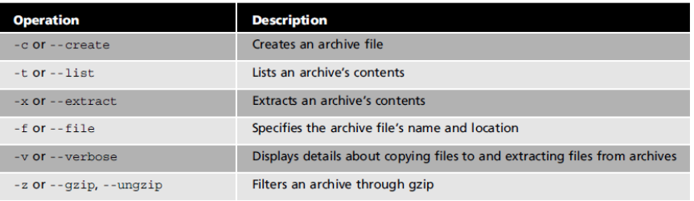
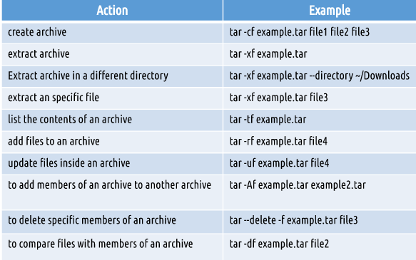
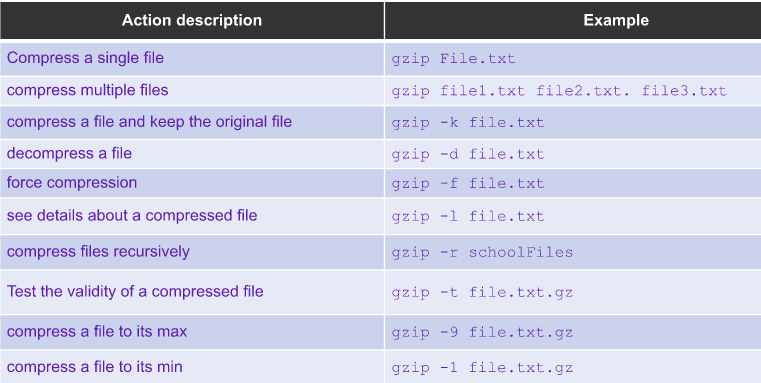
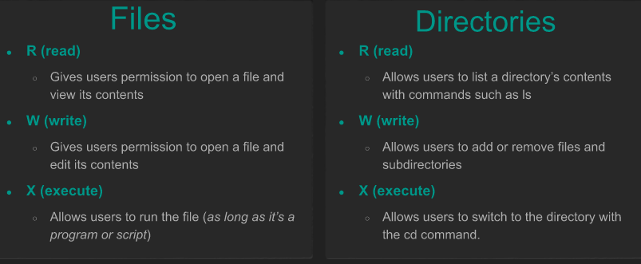

# Notes 6 
# Text Editor
## Basics of Nano 

* Can be open by typing nano
* to get help CTRL+G to get help
* CTRL+O to save
* to exit CTRL+X
* to open already existing file type "nano (file name)"
* open file with in nano CTRL+R 
* to copy data ALT+A to select data and copy ALT+^
* to paste CTRL+U
* to cut CTRL+K
* To move to top ALT \ 
* move to bottom ALT /
* ALT+G to find specific line number
* CTRL+W to look for string.
* ALT+R to replace word
* CTRL Y for page up CTRL V for page down

## Basics of VIM
Vim is not included in Ubuntu.
* Start by typing Vim 
* to quit hit esc and type :qa
  * : -> prefix for entering command line mode
  * q -> short for quit
  * a -> short for all buffers
  * ! -> force 
  * :qa! -> quit all
  * w -> saves
* set line numbers -> :set number
**Vim Modes:** 
* **Insert mode:** 
* **Normal mode:**used for manipulating text
  * Navigating file
    * H = left
    * J = down
    * k= up
    * l = right
* **Command mode:**used for writing text
*  **Visual mode:** used for navigation and manipulation of text selections
*  **Select mode:** similar to visual mode
*  **Ex-mode:** Similar to command-line mode but optimized for batch processing.
   *  when you start vim you are in normal
   *  press i to go to insert mode
   *  to switch back to normal hit esc or ctr+c
* edit by entering e "fileName"
### Moving around words in a file
* to move between words use w e
  * w -> moves word by word to the beginning of each word
  * e -> moves word by word at the end of each sentence.
    * 10e will move 10 words
  * To move between sentences use ()
    * ( -> previous sentence
    * ) -> next sentence
  * To move between paragraphs use {}
    * { -> previous paragraph
    * } -> next paragraph
### Searching words in vim
* use "/" and word 
  * ex) /Potato 
* N -> repeats search for the next word
* ? - > search backwards
* (*) -> will search for next occurrence of the word under the cursor
* (#) -> searches backwards for previous occurrence of the word under the cursor
  ### Screen Movement
  * G -> moves to end of file
  * gg -> moves ti beginning of file
  * CTRL+f -> moves a page forward at a time
  * CTRL+b -> moves a page back at a time
  * to move forward multiple pages use number "2 CTRL+f
  ### Moving lines 
  * to move to a specific line use : plus line number
    * :8 will move to line 8 
  * $ -> moves to end of line
  * 0 -> will move to beginning of line
### Delete text and copy and paste
* dw = delete current word
* u = undo
* dd = delete line under curser
*  d + /word = delete until word given
*  yw = copy yhe current word
*  p = for paste after curser
*  P = paste before curser
*  yy = copies whole line
*  x = for cut
### Change text
* cw = deletes the word under the curser and enter insert mode
* c /hello = deletes until finds the word hello and enters insert mode
* Visual selection 
  * SHIFT + V  select line
  * CTRL + V selectd block
* Replace text
  * : s/oldW/newW = replace old word ofr new
  * : s/old/new = replaces the first occurrence of the word old
  * %s/old/new/g = replaces all occurrences of the word old
  * %s/old/new/g/y = will ask to replace word
  
## Managing Data
**Basic Terminology**
* backup - copies of files and directories to an archive
* system backup used to restore data in a case of a system failure or data loss and corruption
* Archive file containing many other files, each of which is still identified by its file name owner, permissions, and timestamp
* list of important directories to include in system backups:
  * | /etc | /home | /opt | /root | /var |
  ## Archiving utilities 
  * **Tar (tape archive):** creates archive by combining files and directories into a single file/
  * **CPIO:** creates an archive, restores files from an archive, or copies a directpry hierarchy. the cpio utility has 3 modes od operation
    * create (copy-out)  mode places multiple files into a single archive file
    * extract (copy-in) mode restores file from archive
    * pass-through (copy-pass) mode copies a directory hierarchy.
  * **AR:** creates,modifies, and extracts from archives.
### The tar program
* to create archive :
  * tar + options + archive name + files to add to archive
* To extract an archive:
  * tar + options + file to extract
  
  **Tar command example explained**
  
 
  **option -f always required.**
  * the -v option displays details of the operation. 
  * files inside archives are called members.
  
  ### The CPIO program 
  Cpio requires a list of files to archive. the option to create an archive is -o
  * ls | cpio -ov > archive.cpio
  To extract archive to cpio use the -i option with <
  * cpio -iv < archive.cpio 
  Archive specific files
  * find . -iname *.sh | cpio -ov > scriptsArchive.cpio
  Create a tar archive with cpio 
  * ls | cpio -ov -H tar -F sample.tar
  Extract *.tar Archive File using cpio
  * cpio -idv -F sample.tar
  View the content of *.tar Archive file
  * cpio -it -F sample tar
### The ar utility
Creates, modifies and extracts from archives
Archive files with ar
* ar r test.a *.txt
List contents of an archive
* ar t test.a
  Add a new member to an archive
  * ar r test.a test3.txt
  Delete a member from archive
  * ar d test.a test3.txt
  
  ## File Compression
  * The **gxip, bzip2** , and **xz** commands are used for compression.
  * when you compress a file with any of these tools the result is a file with similar name but with the correspondent file extension
  * **Example**
    * file.txt ---> file.txt.gz
    * file.txt ---> file.txt.bz2
    * file.txt ---> file.txt.xz
  ## File compression | GZIP, BZIP2,XY
  * Gzip, bzip2, and xz compares files in place meaning the original file is deleted after compression.
  * **bzip2** offers better compression ratio then gzip
  * **xz** produces better compression ratios than gzip and bzip2.
  #### gzip
  
  #### bzip2
  
  #### xz
  

  ## File compression | zip,7zip, and rar
  * zip is an archiving and compression utility
  * to use : zip + archiveName.zip + files to include in archive
  * to unarchive use : unzip archive.zip
* 7zip 
  * to use : 7z + option + fileName.7z + files to archive
* Rar is a pproprietart archive file format. allows linux users to extract rar archives
  * to use : unrar + option + filename.rar
  
  ## File Permissions | file ownership
  * a file can be owned only by one user and one group
  * **ls -l** shows u=you the file user owner and group owner
  * the **/etc/passwd** file contains a list of all the users in linux
  * the **/etc/group** file contains a list of all the group in linux
  * the **chown** command is used for changing group owner.
    * *syntax* : chown user: group file
    * EX0
      * chown john file.txt
      * chown :marketinGroup file.tex
      * chown john:marketinGroup file.txt
  #### Ls -l output review
  
  #### File Permission
  
  #### Files vs Directories
  

  * the hyphen (-) represents a permission that hasn't been granted.
  ### The chmod command
  * is used to change permission on files and directories
  * the permission argument is the info used to change permission
  * the file/direc argument specifies the file or direc tou want to change
  * you can use chmod in two ways to change permission
    * Symbolic notation
    * Numeric notation
  
  #### Symbolic Notation
  
  
  #### Numeric Notation 
  

  

  